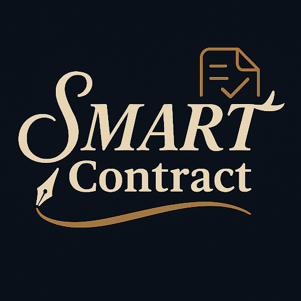
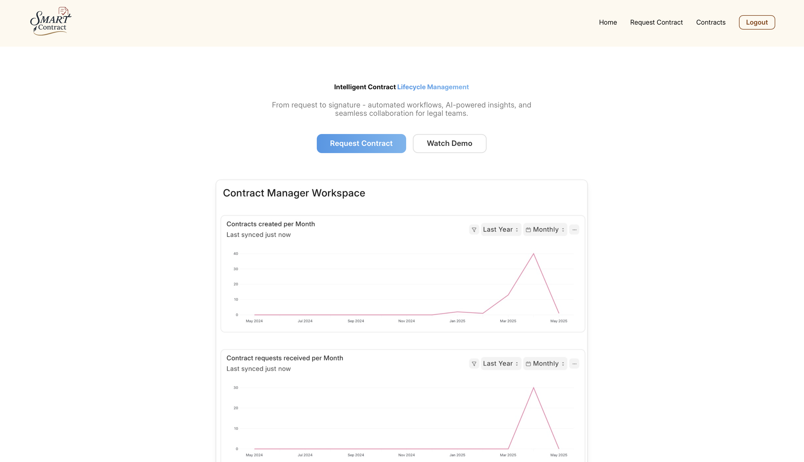
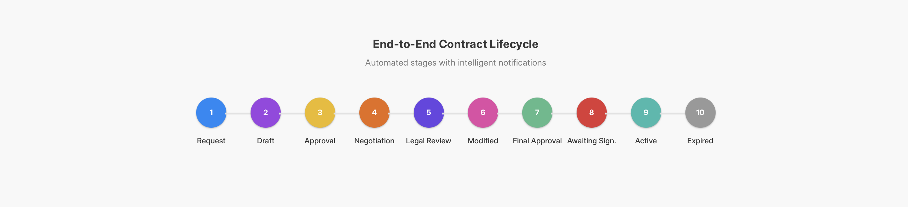
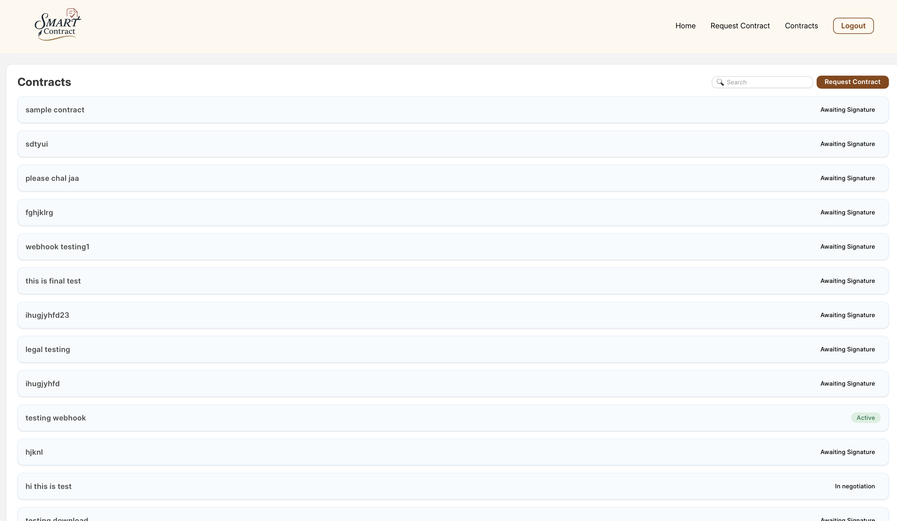
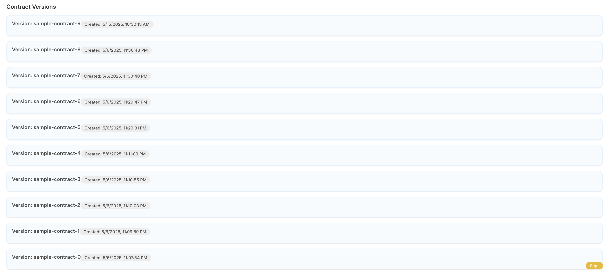

<p align="center">
  
</p>

<h1 align="center">SMARTContract</h1>

<p align="center">
  <b>Intelligent Contract Lifecycle Management Software</b><br/>
</p>

<p align="center">
  
</p>

---

## 🔗 Links

- 🌐 **Website**: [three-korecent.frappe.cloud/frontend](https://three-korecent.frappe.cloud/frontend/)
- 📄 **Documentation**: [View Full Docs (Google Doc)](https://docs.google.com/document/d/1KKku3XUqWi8XfIwr5-n5skCW8oetQCLW6b95e3SczRs/edit?usp=sharing)
- ✍️ **Documenso Integration GitHub Repo**: [Documenso Integration →](https://github.com/ManyaGirdhar/Documenso-Integration.git)

---

## 🚀 Features

- 🔐 **Role-Based Access** — Separate flows for Contract Managers & Counterparties  
- 🔁 **Lifecycle Workflow** — Request → Review → Negotiate → Finalize → Sign → Expire  
- 📣 **Smart Notifications** — Stay informed across contract stages  
- 💬 **Real-Time Collaboration** — Inline discussion & change history  
- 🧠 **Gemini AI Integration** — Instant contract summaries and critical insights  
- 📜 **Version Control** — Track every redline and revision transparently  
- ✍️ **Documenso Integration** — Sign documents securely with open-source eSign  
- 🌐 **Intuitive UI** — Frappe Desk + Dedicated Frontend Portal  

---

## 🧠 Gemini AI Contract Insights

- Automatically summarize contract terms  
- Highlight risky clauses or missing standard provisions  
- Improve turnaround time and comprehension  

---

## 🔁 Contract Lifecycle Workflow

- Request → Draft → Approved → In Negotiation → Legal Review → Modified → Final Approval → Negotiated → Awaiting Signature → Active → Expired / Rejected

<p align="center">
  
</p>

---

## 📑 Contract Dashboard

A centralized dashboard to manage and view all your contracts, their statuses, and actions.

<p align="center">
  
</p>

---

## 📄 Version History

Keep track of all changes made during negotiations with transparent redlining and revision history.

<p align="center">
  
</p>

---

## ✍️ Documenso Integration

This project includes [Documenso](https://github.com/ManyaGirdhar/Documenso-Integration.git), an open-source alternative to DocuSign for signing contracts digitally.  
You need to install our standalone app for documenso [Click here to install!](https://github.com/ManyaGirdhar/Documenso-Integration.git).

- Seamless in-app signing  
- Audit trails and document security  
- Webhook-ready and customizable  

---

## 🛠️ Installation

```bash
# Create a new bench
bench init frappe-bench
cd frappe-bench

# Get the SMARTContract app
bench get-app https://github.com/ManyaGirdhar/Contract-Lifecycle-Management-Software.git

# Create site
bench new-site <yoursitename>

# Install app
bench --site <yoursitename> install-app clm

# Start development server
bench start
